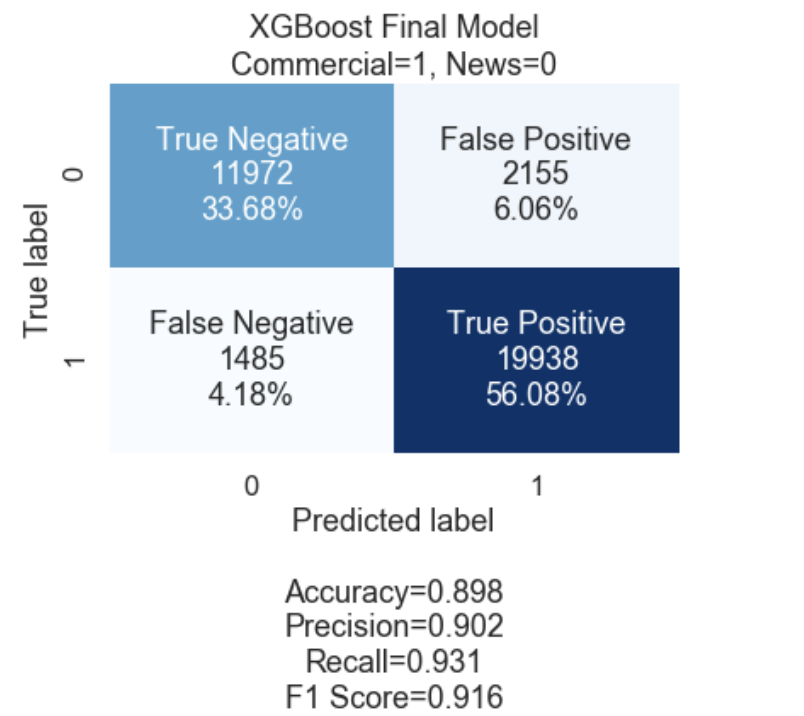
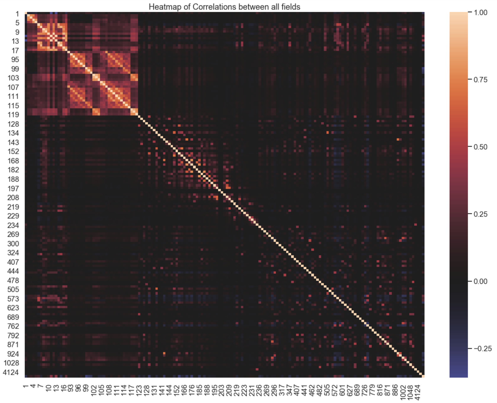
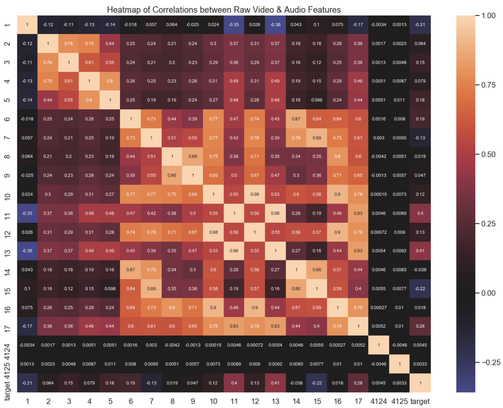
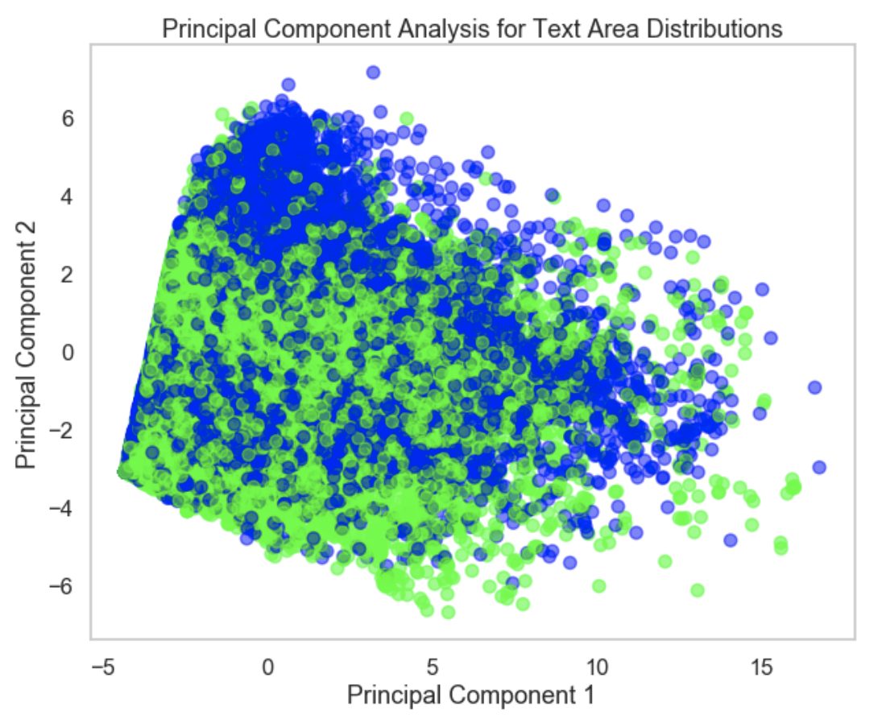
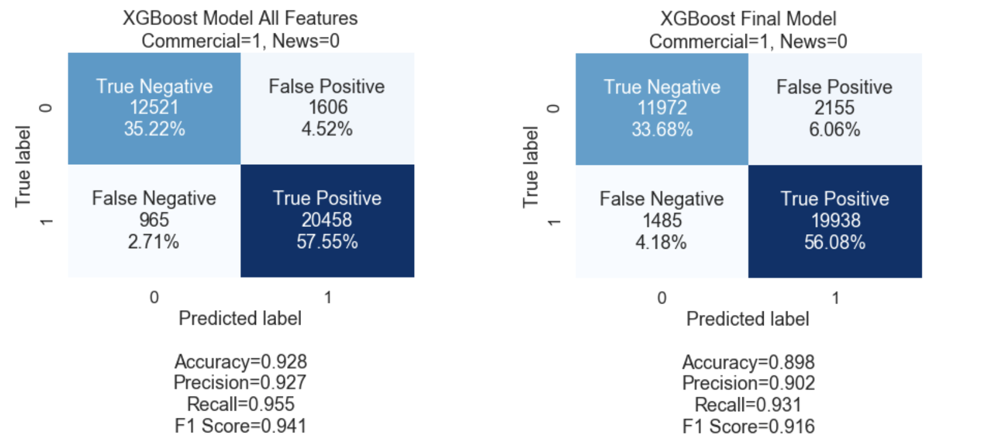

# Module 5 Project

* Student name: **Dennis Trimarchi**
* Student pace: **Full time**
* Instructor name: **Rafael Carrasco**
* Blog post URL: [https://medium.com/@dtuk81/classification-of-video-clips-d7f9d1bdd645]


# Outline

This readme contains sections that summarize the work completed for a data classification model which includes:
* Abstract
* Results Summary
* Recommendations & Future Work
* Exploratory Data Analysis
* Model Process and Selection

**All of my Python work is completed in the following files**:
* **[Mod5Project_DataCleaning.ipynb](Mod5Project_DataCleaning.ipynb)**
  * A jupyter notebook containing raw data import and cleaning. Here you will see feature histograms and initial correlation matrices. Cleaned data is stored in *df.pickle* file for use by other notebooks.
* **[Mod5Project_EDA_Modeling.ipynb](Mod5Project_EDA_Modeling.ipynb)** 
  * A jupyter notebook containing EDA and Modeling for different subsets of data.
* **[Mod5Project_Modeling_Final.ipynb](Mod5Project_Modeling_Final.ipynb)** 
  * A jupyter notebook which fits models for each data subset and stores the results into a dataframe for inspection. This notebook also contains model selection and cross validation results. The models and model stats are stored in *model_results.pickle* file.
* **[df.pickle](df.pickle)**
  * Pickle file containing cleaned data. This file is created by the Data Cleaning notebook and used by the other notebooks.
* **[model_results.pickle](model_results.pickle)** 
  * Pickle file containing the fitted models, model parameters, and model results - precision and accuracy. This file is provided for any future inspection as it takes a long time to run all of the model fitting code. 

**Dataset Source:**
* http://archive.ics.uci.edu/ml/datasets/tv+news+channel+commercial+detection+dataset
  * Only BBC and CNN data used in this project.

-------

    
# Abstract

This project comprises analysis of video clip data collected during news broadcasts. In particular, the video data used comes from both BBC and CNN. The goal of the project is to create a classification model for this dataset. Model goal: identify commercials from video clip data collected during news broadcasts.

**Question/Problem:** 
Can video clip features be used to determine whether or not a video clip is a commercial or broadcast news? If so, how well?

**Why?**
Identification of commercial video blocks has great market value as people generally want the option to skip them. Additionally, it can be useful for determining level of program content versus commercial advertising, etc.

**Metric Used - Precision.** Precision  = True Positives/Predicted Positives. In using this metric for optimization, the model aims to reduce False Positives. Precision was chosen because, while a viewer wants to skip commercials, they do NOT want to accidentally skip over their actual desired non-commercial content. Failing to skip a commercial is considered more desireable than accidentally skipping over the news content.

**Process:** The dataset contains many feature dimensions and it quickly became a cost/benefit necessity to reduce the features used in model fitting. The process to determine the best model involved obtaining a base estimate of potential model accuracy and precision (by fitting models using all of the features). Then, iteratively dropping, transforming, and adding features to be used in the final classifier. The sub-goal became reduction of features to less than 20 (from 231 at the start).

-------

# Results Summary

Baseline models with all features provided gave results with best precison and accuracy measurements in the 91-93% range for both training and test sets of data. The final model was fit on 11 of the original 231 features which represents a very significant reduction in dimensions for modeling. With a minimal decrease in precision, an eXtreme Gradient Boosting (XGBoost) model was selected. See details below:

**MODEL TYPE** 
- xgboost.XGBClassifier

**MODEL PARAMETERS** 
- *gamma*=1 
- *learning_rate*=0.1 
- *max_depth*=4 
- *n_estimators*=100

**CONFUSION MATRIX**




**MODEL FEATURES**
ranked by importance:
- 104,92: Text Area Distribution bins
- 6: Short Time Energy
- 118,99: Text Area Distribution bins
- 15: Spectral Flux Variance
- 102: Text Area Distribution bin
- 4: Mean Frame Difference Distribution
- 11: Spectral Centroid Variance
- 8: Mean Zero Crossing Rate
- 100: Text Area Distribution bin

-------

# Recommendation & Future Work

**RECOMMENDATION**

An **eXtreme Gradient Boosting model is recommended** as the best approach to commercial detection based on the dataset used. The model uses 11 features (approximately **95% reduction in features** from the original dataset). The model provides **precision of 90.2%** compared to 92.7% the model which used all 231 features. From a cost-benefit standpoint, this is very good. Additionally, the accuracy of the model is appropriate at 89.8% (the model is not overloaded with False Negatives).

**FUTURE**

While the audio and visual signal data features are very interpretable, **some of the features in the dataset are not interpretable without additional information** about how they were collected and what they represent. In particular, the **bin descriptions in the "bag of words" features and "text area distribution" features are not provided**. The important features were identified, but without detailed bin information, these features cannot be interpreted clearly. It is impossible to determine where the important on-screen text locations are physically located onscreen. While the bag of words features were not used in the final model, it would be nice to know which words drove other models (the Random Forest models used more of the bag of words features). Obtaining this information requires additional details about the provided dataset, notably how the bins were selected and filled. 

-------

<details><summary>Exploratory Data Analysis</summary>
    
# Exploratory Data Analysis

## Dataset

**Number of Records:** 35,550 (after data cleaning)

**Number of Labels:** 2
- 1, Commercials, 21423 records
- 0, Non Commercials, 14127 records

**Number of Features:** 231
- 1 - Shot Length - Length of video clip
- 2,3 - Motion Distribution(Mean and Variance): *Video* - Measurement of video motion.
- 4,5 - Frame Difference Distribution (Mean and Variance): *Video* - Measurement of video motion.
- 6,7 - Short time energy (Mean and Variance): *Audio* - Reflects amplitude variations in the signal.
- 8,9 - ZCR( Mean and Variance): *Audio* - Measure of the frequency content of the signal.
- 10,11 - Spectral Centroid (Mean and Variance): *Audio* - Location of center of mass of audio spectrum.
- 12,13 - Spectral Roll off (Mean and Variance): *Audio* - Measurement of right-skewdenss in signal.
- 14,15 - Spectral Flux (Mean and Variance): *Audio* - Measurement of audio spectrum change.
- 16,17 - Fundamental Frequency (Mean and Variance): *Audio* - Measurement of audio pitch.
- 18-58 - Motion Distribution (40 bins)
- 59-91 - Frame Difference Distribution (32 bins)
- 92-122 - Text area distribution (15 bins Mean and 15 bins for variance )
- 123-4123 - Bag of Audio Words (4000 bins)
- 4124-4125 - Edge change Ratio (Mean and Variance): *Video* - Used to detect and classify scene transitions.

Note: The feature numbers above are used to identify the features in the dataset. Even though there are many features identified above (4125 in total), only 231 features actually contained any data in the raw dataset. Almost all of the empty features are in the Bag of Audio Words columns.

## Cleaning

Filled null values for bag of word audio words columns with "0" to represent absence of word in bin. Filled null values for text area distribution columns with "0" to represent absence of text in area bin. 

Dropped columns 18-91: Motion Distribution bins and Frame Difference Distribution bins because this data is already represented in columns 2-5.

Removed 4,715 ouliters - Most of those (3,961) where audio data is missing.

## Analysis

This dataset contains a lot of multicollinearity. Most of the video features are multi-collinear and most of the audio features are multi-collinear. I performed kbest analysis and used feature importances for some basic models to help decide which collinear features to remove. 





Removed collinear features summary:
- Kept 4 (Mean Frame Difference Distribution), dropped 2,3,5
- Kept 8 (Mean Zero Crossing Rate), dropped 9, 16
- Kept 11 (Spectral Centroid Variance), dropped 10,12,13,17,1
- Kept 15 (Spectral Flux Variance), dropped 7, 14
- Also Dropped 4124, 4125 - not collinear, but also not useful in any model.

I performed Primary Component Analysis (PCA) on both the Text Area Distribution Features (92-122) and the Bag of Audio Words Features (123-4123). I performed the PCA on each group of features separately. PCA on Text Area Distribution appeared promising with about 75% of the variance explained with 5 PCA features. However, for the Bag of Audio Words Features, 26 PCA features were required to obtain only 50% of the variance in the data.

**Blue = Commercial, Green = Non-commercial**




Beyond PCA, I tested different datasets with subsets of the Text Area Distribution and Bag of Audio Words Features. All of this analysis is contained in the EDA and Modeling Jupyter Notebook.

</details>

-------

<details><summary>Modeling Process & Selection</summary>
    
# Modeling Process & Selection

With precision chosen as the scoring function to use, I slowly tweaked parameters for Random Forest (RF), Support Vector Classifier (SVC) and eXtreme Gradient Boost (XGB) models while fitting them to subsets of the dataset.

**PROCESS:**
1. Created a dictionary of datasets (each containing different sets of features).
- Performed a train test split once with 15% of data reserved for validation.
- Fit models to every dataset in a loop using gridsearch and crossvalidation on training data.
- Stored models and model stats in *results* - a list of dictionaries.
- Applied models to test data set and stored output in results.
- Chose best model and performed cross validation on total dataset (both train and test data together)

**DATASETS Tested:**
1. All Features
2. Only Audio Video Columns
3. Only Audio Video Columns with collinear columns dropped.
4. Non-collinear Audio Video features, PCA on text-area fields, highest ranked bag-of-words features.
5. **Chosen Dataset** Non-collinear Audio Video features and highest ranked text-area features. 
6. All Audio Video Columns and highest ranked text-area and bag-of-words features.


**MODEL TYPES and GRIDSEARCHCV PARAMETERS USED:**
```
#Random Forest
rf_clf = RandomForestClassifier(max_features='auto')
param_grid_rf = [{'criterion': ['gini,'entropy'],
                  'max_depth': [5,6,7,8],
                  'n_estimators': [50,100] }]

#XGBoost
xgb_clf = xgb.XGBClassifier()
param_grid_xgb = [{'max_depth': [3,4,5],
                   'n_estimators': [50, 100],
                   'learning_rate': [0.1, 0.2],
                   'gamma': [0, 1] }]
#Support Vector
svc_clf = SVC()
param_grid_svc = [{'C': [1, 10],
                   'gamma': ['auto'] }]

```
**MODEL SELECTION**

The RF models were the only models that highly ranked the bag-of-words features. RF also tended to greatly overfit the training data when a max_depth parameter was not set. The XGB models would overfit the data with higher max_depth, and learning_rate values which required later limitation to max_depth of 3 and learning_rate of 0.1. The SVC models were the slowest to fit and performed about the same as the XGB models. While all models performed similarly in terms of classification sucess, the RF models consistenly performed just slightly worse than the other two model types. An XGB model was selected as the best performing model for the reduced feature dataset.

A confusion matrix of the baseline model containing all 231 features and the final model based on 11 selected features is shown below.



</details>
